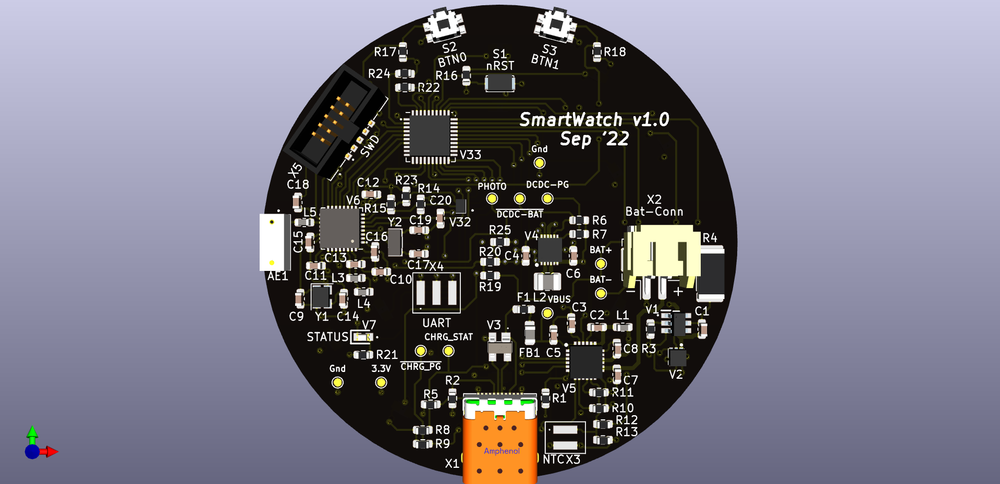
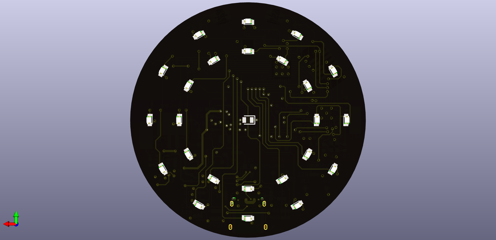

# smartWatch

is a simple, digital wristwatch that uses LEDs to indicate the position of each clock arm.

## Smart Features

The smartWatch incorporates an nRF52810 for handling BLE connectivity to send the monitored data regularly to the host device.

## PCB Design

The PCB was designed using [KiCad](https://kicad.org).

PCB front-side

PCB back-side

## Future Features

A future revision will include a biomedical sensor to enable even more smart functionalities i.e. SpO2 and heart-rate measurements.
